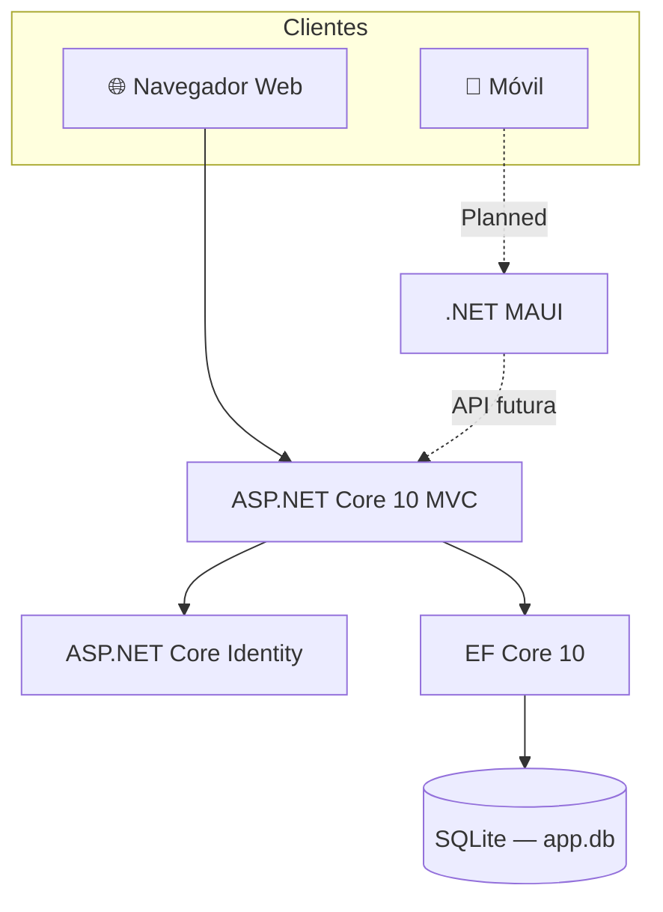

# 🎮 GameVault

**Plataforma de Catalogación, Preservación e Intercambio de Activos de Videojuegos Retro**


---

## Descripción

Catalogar una colección de videojuegos retro es más difícil de lo que parece: la información sobre plataformas, regiones y estados de conservación está dispersa, y en Latinoamérica los precios y la disponibilidad varían enormemente de un país a otro. Los coleccionistas recurren a hojas de cálculo, grupos de redes sociales o sitios en inglés que no reflejan la realidad del mercado local.

GameVault resuelve este problema ofreciendo un catálogo centralizado donde cada coleccionista registra sus activos con datos estructurados: plataforma, región (NTSC/PAL), estado de conservación y valor estimado en USD. La plataforma estandariza la información y permite encontrar piezas específicas sin depender de búsquedas informales.

Más allá del catálogo, GameVault construye comunidad: los usuarios publican ofertas de venta o intercambio, negocian directamente y se evalúan mutuamente a través de un sistema de reseñas y puntuación de reputación. El objetivo es que los coleccionistas de América Latina tengan un espacio propio, seguro y en su idioma.

---

## 👥 Equipo — Nexus Asset Labs

| Nombre | Rol | Módulo |
|---|---|---|
| Flavio Ibujes | Líder de Proyecto | Módulo de Catálogo |
| Elian Hidalgo | Backend | Módulo de Intercambios |
| David Morales | Frontend / QA | Módulo de Comunidad |

---

## 🎓 Contexto Académico

| | |
|---|---|
| **Curso** | Programación IV |
| **Profesor** | PhD(c) Luis Fernando Aguas Bucheli |
| **Universidad** | Universidad de las Americas |
| **Período** | 2026 |

---

## 🏗️ Arquitectura



Actualmente solo existe la capa Web MVC. El cliente móvil MAUI y la API compartida están planificados para fases posteriores del proyecto.

---

## ✅ Funcionalidades

- [x] Autenticación y registro de usuarios (ASP.NET Identity)
- [x] Modelos de dominio: Asset, TradeOffer, Review
- [x] Localización completa en español (es-EC)
- [ ] CRUD de catálogo de activos
- [ ] Marketplace de intercambios
- [ ] Sistema de reputación y reseñas
- [ ] Aplicación móvil (.NET MAUI)

---

## 🚀 Cómo ejecutar localmente

**Prerequisitos**
- [.NET SDK 10](https://dotnet.microsoft.com/download)
- EF Core CLI: `dotnet tool install -g dotnet-ef`

**Pasos**

1. Clonar el repositorio:
   ```bash
   git clone <url-del-repositorio>
   cd GameVault
   ```

2. Restaurar dependencias NuGet:
   ```bash
   dotnet restore
   ```

3. Restaurar librerías front-end (la carpeta `wwwroot/lib/` está en `.gitignore`):
   ```bash
   dotnet tool run libman restore
   ```

4. Aplicar migraciones y crear la base de datos:
   ```bash
   dotnet ef database update
   ```

5. Ejecutar la aplicación:
   ```bash
   dotnet run
   ```

6. Abrir en el navegador: `http://localhost:5236`

---

<details>
<summary>📐 Convenciones del Repositorio</summary>

### Ramas

| Rama | Propósito |
|---|---|
| `main` | Código estable, listo para demostración |
| `develop` | Integración continua del equipo |
| `feature/<nombre>` | Nuevas funcionalidades |
| `fix/<nombre>` | Correcciones de errores |

### Commits — Conventional Commits

Formato: `tipo(alcance): descripción`

| Tipo | Uso |
|---|---|
| `feat` | Nueva funcionalidad |
| `fix` | Corrección de error |
| `docs` | Cambios en documentación |
| `style` | Formato, sin cambio de lógica |
| `refactor` | Refactorización sin nuevo comportamiento |
| `test` | Añadir o corregir pruebas |
| `chore` | Tareas de mantenimiento |

Ejemplo: `feat(catalog): agregar vista de detalle de activo`

### Pull Requests

- Toda funcionalidad se desarrolla en una rama `feature/*` y se integra a `develop` mediante PR.
- Se requiere la revisión de al menos un compañero antes de hacer merge.
- El PR debe pasar `dotnet build` sin errores antes de solicitar revisión.

</details>

---

## 📄 Licencia

> Proyecto académico — Universidad de las Americas, 2026. Desarrollado con fines educativos únicamente. Todos los derechos reservados por el equipo Nexus Asset Labs.
